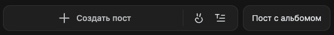
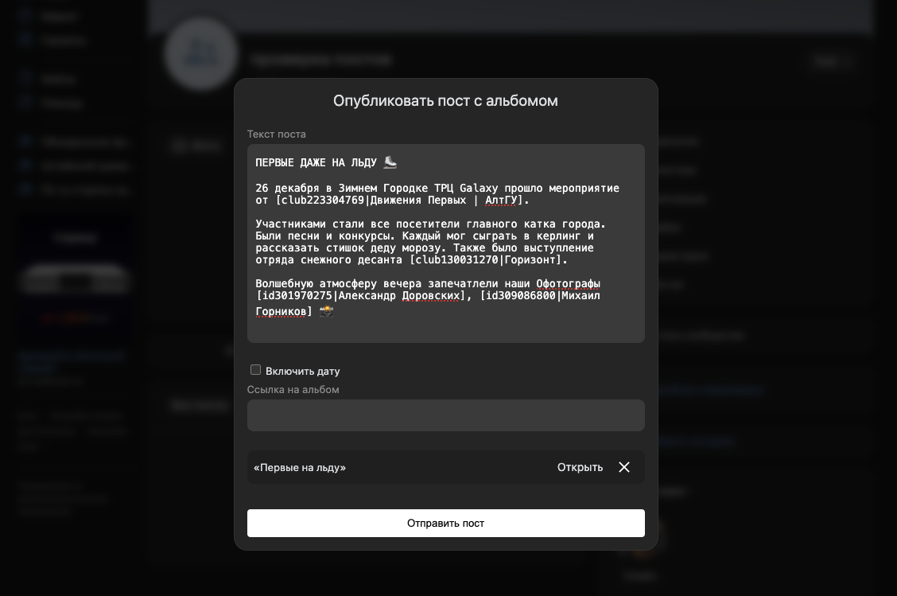
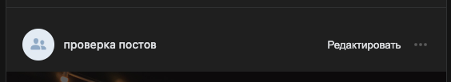

# VK Album Posts

Инструмент для публикации постов с альбомами в ВКонтакте.

### Описание

ВКонтакте недавно обновили редактор, убрав возможность публикации постов с альбомами. Этот инструмент позволяет публиковать и редактировать такие посты. Поддерживаются отложенные посты.

## Установка

1. Перейдите на страницу [релизов](https://github.com/semolik/vk-album-posts/releases) и скачайте архив с расширением.
2. Распакуйте архив в удобное для вас место.
3. Следуйте инструкциям для установки расширений в вашем браузере:
    - Для Chrome: откройте `chrome://extensions/`, включите режим разработчика, нажмите "Загрузить распакованное расширение" и выберите папку с распакованным архивом.
    - Для Яндекс.Браузера: откройте `browser://extensions/`, включите режим разработчика, нажмите "Загрузить распакованное расширение" и выберите папку с распакованным архивом.

> **Важно:** Не удаляйте папку с распакованным архивом, иначе расширение может перестать работать.

## Использование

После установки расширения рядом с кнопкой создания поста появится кнопка "Пост с альбомом".



При нажатии на нее откроется модальное окно где вы сможете создать пост с альбомом.
Когда вы вставляете ссылку на альбом она обрабатывается и под полем ввода текста поста появляется блок с названием альбома.



Также к постам с альбомами добавится кнопка "Редактировать". <b>При редактировании поста с вложениями, помимо альбомов, они будут удалены (будет поправлено в будущем). </b>



## Для разработчиков

### Установка

#### Зависимости

-   Node.js

1. Клонируйте репозиторий:

```bash
git clone https://github.com/semolik/vk-album-posts.git
cd vk-album-posts
```

2. Установите зависимости:

```bash
npm install
```

### Использование

1. Запустите приложение:

```bash
npm run dev
```

### Сборка

Для сборки проекта используйте следующие команды:

1. Сборка для Chrome и Яндекс.Браузера:

```bash
npm run build
```

2. Создание zip-архива для Chrome или Яндекс.Браузера:

```bash
npm run zip
```
